# 1. Buffer Overflow

## Experiência 1.1 - Organização da memória do programa

A imagem abaixo ilustra o output o comando `size` para cada um dos ficheiros.

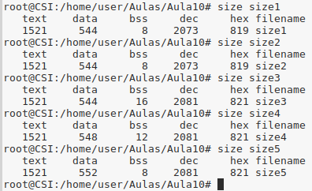

A tabela abaixo mostra os valores nos vários segmentos de `texto`, `dados` e `bss` de cada um dos ficheiros.

|           | size1.c | size2.c | size3.c | size4.c | size5.c |
|-----------|---------|---------|---------|---------|---------|
| **Texto** | 1521    | 1521    | 1521    | 1521    | 1521    |
| **Dados** | 544     | 544     | 544     | 548     | 552     |
| **BSS**   | 8       | 8       | 16      | 12      | 8       |

- **Segmento de texto**

    Também conhecido como `Segmento de código`, é uma porção de um *object file* ou a secção correspondente do espaço de endereço virtual do programa que contém instruções executáveis.

    O mesmo valor em todos os ficheiros deve-se ao facto de que este segmento é tipicamente *read-only* na memória e tem tamanho fixo.

    **(Fonte: https://en.wikipedia.org/wiki/Code_segment)**

 

- **Segmento de dados**

    O segmento de dados (geralmente denotado .data) é uma porção de um *object file* ou o espaço de endereçamento virtual correspondente de um programa que contém variáveis estáticas inicializadas, isto é, variáveis globais e variáveis locais estáticas. 
    
    O tamanho desse segmento é determinado pelo tamanho dos valores no código-fonte do programa e não é alterado no tempo de execução.

    O ficheiro 4 e  têm valores superiores pois o ficheiro `size4.c` possui uma variável estática inicializada e o ficheiro `size5.c` possui 2, daí o seu segmento de dados ser o maior. Os ficheiros `size1.c`, `size2.c` e `size3.c`, não têm variáveis inicializadas, por isso é que têm o mesmo valor.

    **(Fonte: https://en.wikipedia.org/wiki/Data_segment)**

     

- **BSS (Block Started by Symbol)**

    O nome `.bss` ou `bss` é usado por muitos compiladores e linkers para uma parte do segmento de dados que contém variáveis alocadas estaticamente que não são explicitamente inicializadas para qualquer valor. 
    
    É muitas vezes referida como a `bss section` ou `bss segment`.

    Apesar de o ficheiro `size1.c` não possuir variáveis guardadas no bss, este ocupa o mesmo que o `size2.c` porque quando o programa carrega, são alocados `8 bits ` por definição.
    
    O ficheiro `size3.c` possui o dobro da memória no bss do `size1.c` pois contém 2 variáveis não inicializadas, ao invés de 1, daí os `16 bits` em vez dos `8`.

    Como o ficheiro `size4.c` possui 1 variável não incializada e outra inicializada, o segmento bss ocupa `12 bits` (8 + 4), pois para uma variável inicializada a memória alocada é metade.

    O ficheiro `size5.c` possui 2 variáveis inicializadas, logo são alocados `8 bits` (4 + 4).

    **(Fonte: https://en.wikipedia.org/wiki/.bss)**

 

## Experiência 1.2 - Organização da memória do programa

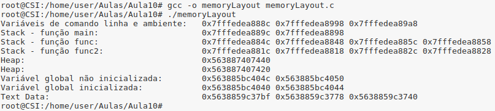

 

## Pergunta P1.1 - Buffer overflow em várias linguagens

Ao correr os programas em `Java` e `Python`, quando se tenta aceder a um índice superior aos do array (por exemplo índice 10 num array com 10 elementos, em que o maior é 9)  é lançada uma exceção indicando que a posição está "fora dos limites". 

#### Java     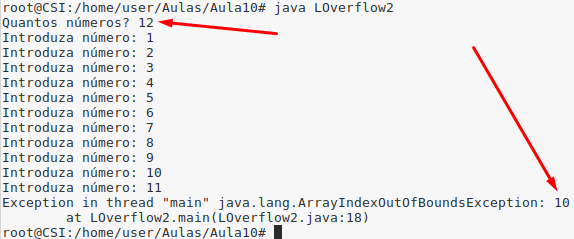

#### Python     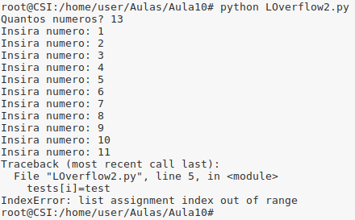

No programa em C++, quando se tenta aceder a um índice superior ao do limite no array, o programa não lança nenhuma exeção como os anteriores e continua a correr até que encontre uma posição na memória que não pertença ao programa. Se isto acontecer, é devolvido um `Segementation Fault`. O programa pára.

#### C++     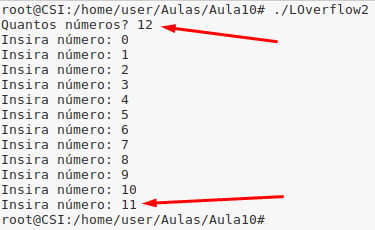

#### Segmentation Fault     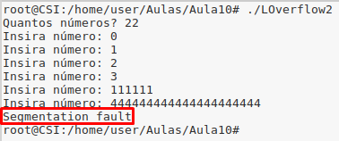

 

## Pergunta P1.2 - Buffer overflow em várias linguagens

Ao executar os programas `LOverflow3.java` e `LOverflow3.py`, estes comportam-se da mesma forma que os anteriores, contudo para o programa `LOverflow3.cpp`, se tentar aceder a un índice do array superior ao que este permite, ele fica em mode de espera.

#### C++     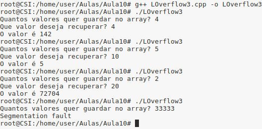

 

## Pergunta P1.3 - Buffer overflow

- **RootExploit.c**
    - A Vulnerabilidade neste programa diz respeito a este não respeitar o limite de 5 caracteres da passwords a inserir (**char buff[4];**). Se o utilizador inserir 5 ou mais caracteres, "São atribuidas permissões de admin" na mesma.

        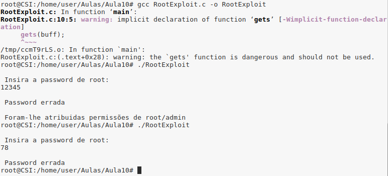

- **0-simple.c**
    - A vulnerabilidade neste programa diz respeito a este não ter em conta se o input é maior que o buffer (**char buffer[64];**).

        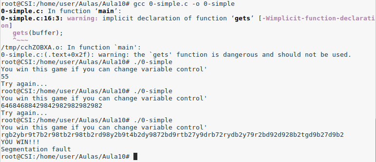

 

## Pergunta P1.4 - Read overflow

A vulnerabilidade no programa `ReadOverflow.c` deve-se ao facto de este ler mais informação que a quera suposta. Se o utilizador só escolher inserir 6 caracteres, por exemplo, não deveria ser possível inserir mais, apesar de o output ser apenas os caracteres que o utilizador escolheu.

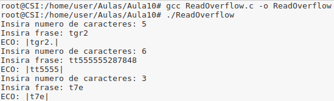

 

## Pergunta P1.5

Como a arquitetura é `little-endian`, o que significa que os valores são representados ao contrário, ou seja, do `LSB` para o `MSB`

(**Fonte: https://pt.wikipedia.org/wiki/Extremidade_(ordena%C3%A7%C3%A3o)**)

Deve-se então inserir 64 + 12 caracteres (para preencher a memória necessária neste programa até ser possível alterar a variável) e depois inverte-se o endereço `0x61626364` (**\x64\x63\x62\x61**). 

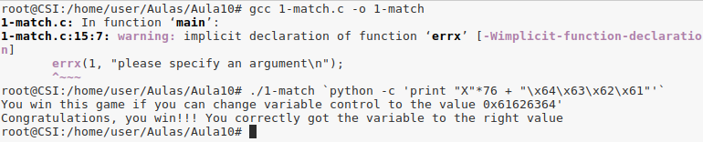

 

## Pergunta P1.6

Para explorar a vulnerabilidade seguiu-se os seguintes passos:

1. Compilou-se o programa em modo debug com `gcc 2-functions.c -g -o 2-functions`.

2. Iniciou-se o programa em modo debug com o `gdb` usando o comando `gdb 2-functions`.

3. Colocou-se breakpoint na função `win()` com `b win`.

4. No `gdb`, executou-se o programa até ao breakpoint com o comando `r`.

5. No gdb, obteu-se informação sobre a frame actual de execução do programa usnado `info f`.

6. Obteu-se o endereço de memória onde está guardada a função `win()`. Para isso, no gdb usou-se o comando `p win`.

    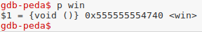

7. Depois de descoberto o endereço de memória onde a função está (**0x555555554740**), fez-se o mesmo que o programa anterior, mas mudando o número de caracteres antes de o programa alterar a `variável fp` (**72 neste caso**) e o endereço em que a função se encontra em `little-endian` (**\x40\x47\x55\x55\x55\x55**) traduzido para `código ASCII` (que corresponde a **@GUUUU**).    
Assim sendo o imput será: `1234567890123456789012345678901234567890123456789012345678901234567890aa@GUUUU`, por exemplo (**72 caracteres** + o endereço de memoria da **função win** em **little-endian** em **ASCII**).
    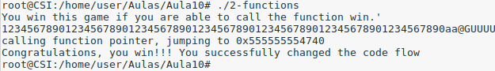

 

## Pergunta P1.7

A exploração deste vulnerabilidade é muito semelhante à anterior, contudo devemos ter mais uma vez atenção ao número de caracteres necessários e ao endereço de memória da função `win` (**0x5555555546f0**).
    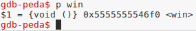

Em `little-endian`, o endereço de memória é invertido para `\xf0\x46\x55\x55\x55\x55` que ao converter para `ASCII` resulta em `ðFUUUU`.
