# 1. Vulnerabilidade de inteiros

## Experiência 1.1     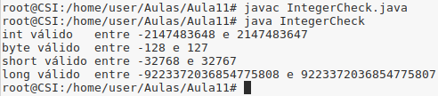

 

## Experiência 1.2     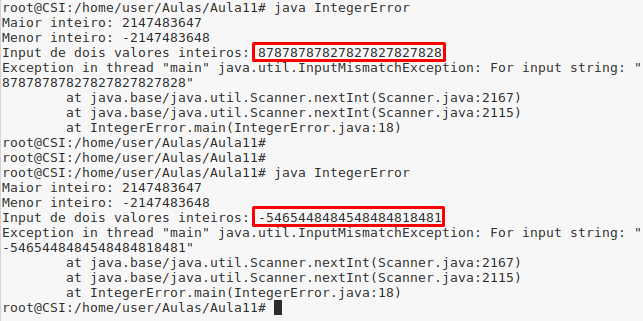

Para usar inteiros maiores, deve-se recorrer a inteiros de `64 ou mais bits` pois o limite de `-2147483648 a 2147483647` corresponde a todos os inteiros possíveis de `32 bits`.

 

## Experiência 1.3

- Quando se tenta atribuir um long a um inteiro, por exemplo, este retorna -1, pois por definição a um inteiro (de 32 bits) só podem ser atribuídos números de `-2147483648 a 2147483647`, como já visto anteriormente.

    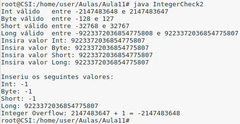

    Abaixo fica outro exemplo em C#.

    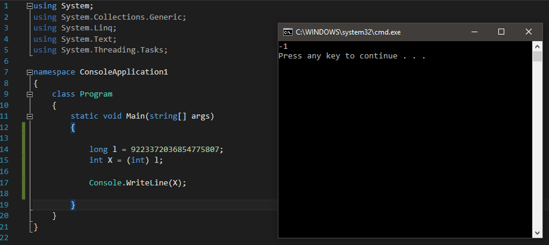

- Em todos eles, o programa dará o mesmo erro 

    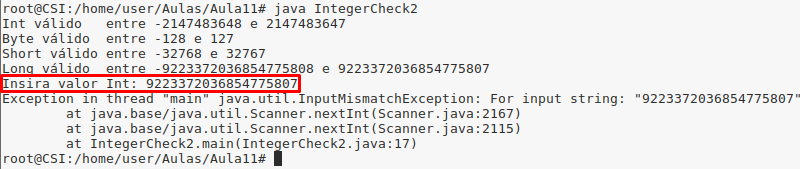

    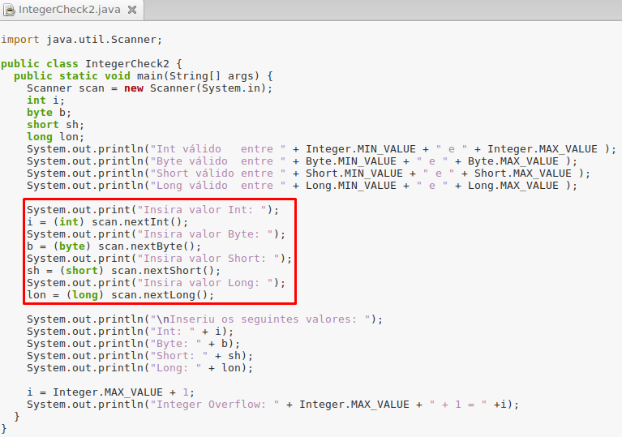
    
 

## Pergunta P1.1

1. A vulnerabilidade deve-se ao facto de poderem ser passados como parâmetros números maiores que o tipo `size_t` para as variáveis `x e y`. Desta forma, os mesmos são convertidos para números menores o que levaria a que se escrevesse em memória não alocada para esta função.

2.  

    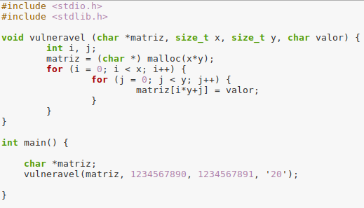

3. Executando o programa, obtem-se um `segmentation fault`. Isto deve-se ao facto de não ser alocada a memória necessária.

    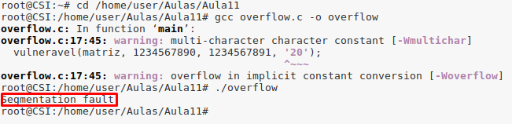

 

## Pergunta P1.2

1. Neste programa, a vulnerabilidade na função *`vulnerável()`* está relacionada com a variável `tamanho` passada como argumento. A função não estabelece um limite inferior (A variável `tamanho_real` só estabelece o limite superior com `tamanho_real = tamanho - 1;`). Desta forma, se for passado como `tamanho o valor 0`, à variàvel `tamanho_real` será atribuído o valor `-1`.

    É aqui que se verifica a vulnerabilidade, pois como ambas as variáveis, `tamanho` e `tamanho_real`, são do tipo `size_t`, a segunda será um valor negativo e só suporta números maiores ou iguais a 0.

    (**Fonte: https://www.geeksforgeeks.org/size_t-data-type-c-language/**)

2.  

    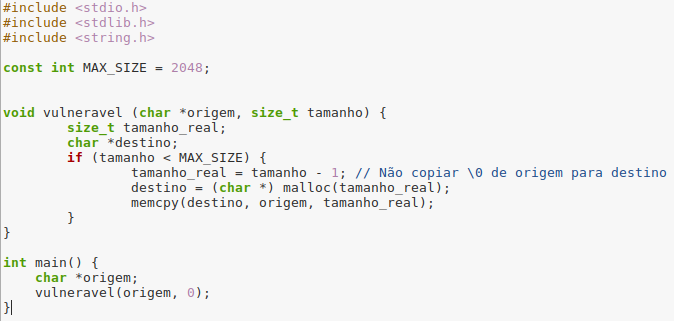

3. Executando o programa, obtem-se um `segmentation fault` pois não é conseguida alocar a memória pretendida.

    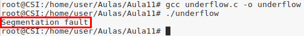

 

## Pergunta P1.3

1. No programa `erro_sinal.c`, a vulnerabilidade deve-se ao facto de, agora, ter sido trocado o tipo de dados na variável `tamanho_real` (de `size_t`, nos programas anteriores, para `int`), apesar de agora haver um limite inferior para os números (pois a um `int` podem ser atribuídos númros positivos e negativos.)

    Sendo que o limite de um `int de 32 bits` é de `-2147483648 a 2147483647`, ao atrubuir um  valor superior a uma variàvel `size_t` (de `64 bits`), quando for convertida para um `int`, como o valor será superior ao suportado, este será convertido em negativo, obtendo-se um `overflow`, como visto anteriormente.

2.  

    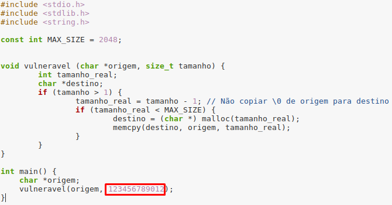

3. Executando o programa, obtem-se um `segmentation fault`.

    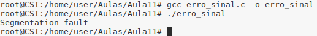