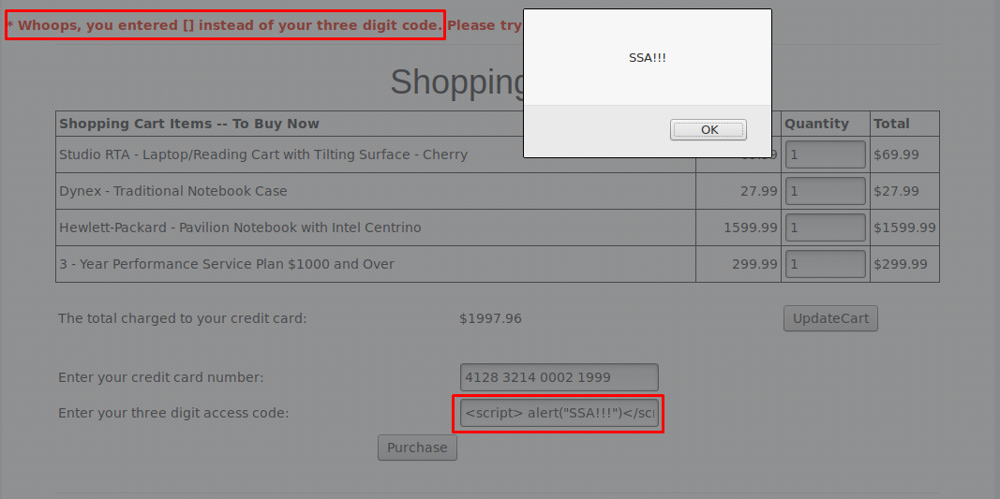

# 1. Injection

## Pergunta 1.1 - *String SQL Injection*

- Output para o nome `Smith`.

    

    
- Usando a tautologia `'OR 1=1'`.

    

## Pergunta 1.2 - *Numeric SQL Injection*

- Usando a tautologia `'OR 1=1'`.

    

## Pergunta 1.3 - *Database Backdoors*

- Output para o ID `101`.

    

- Usando a tautologia `101; update employee set salary=150000`.

    

 

# 2. XSS

## Pergunta 2.1 - Reflected XSS

- Input inicial.

    

- Reflected XSS.

    

 

# 3. Quebra na Autenticação

## Pergunta 3.1 - Forgot Password

- Recuperação da password para utilizador `webgoat` e cor `red`.

    

- Recuperação da password para utilizador `admin` e cor `green`.

    