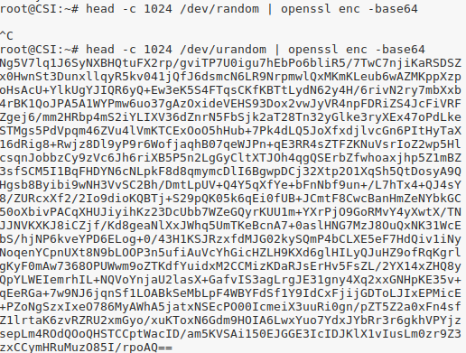
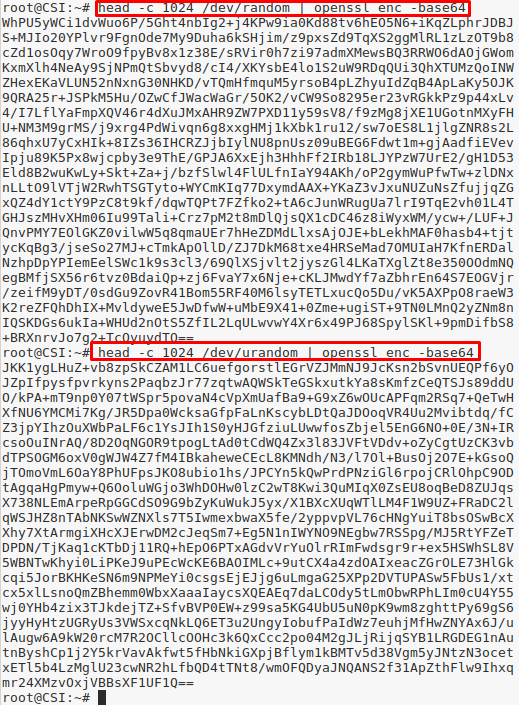
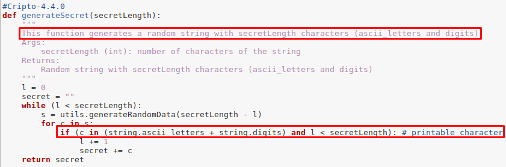
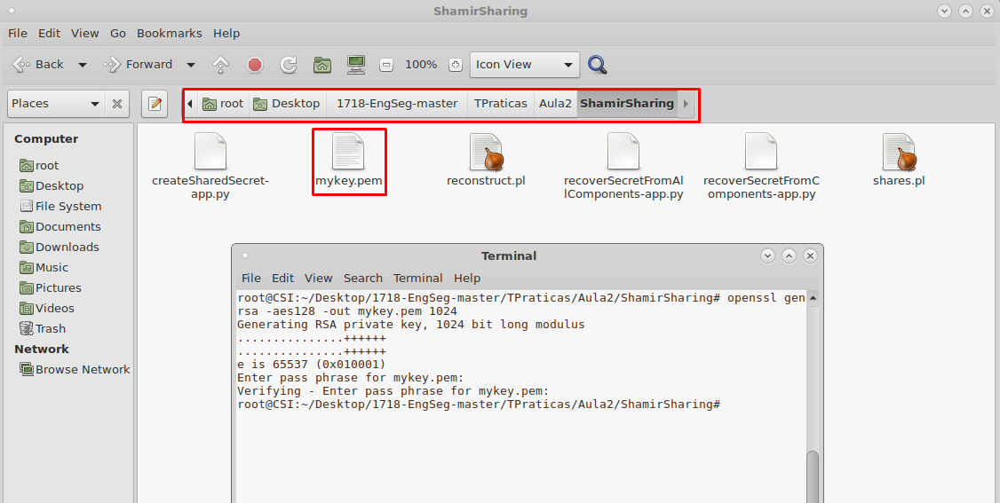
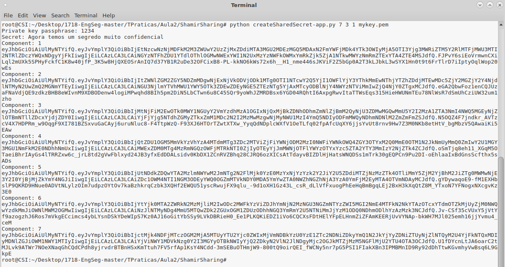
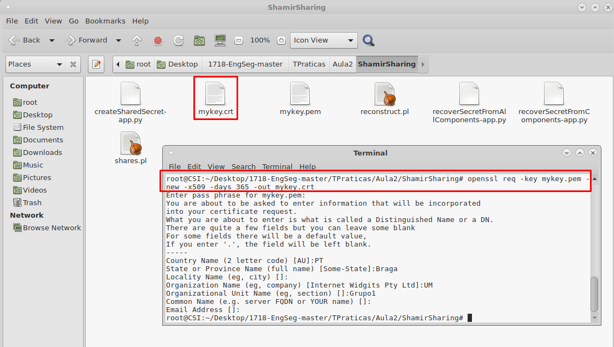
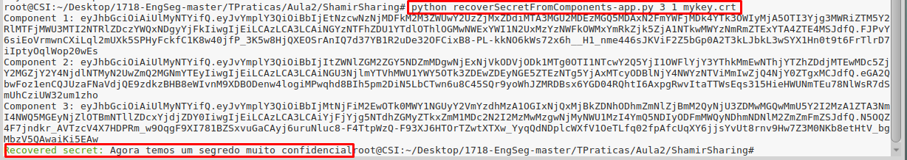
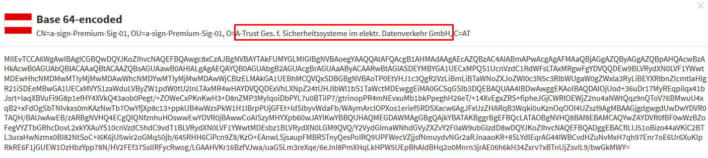

# 1. Números aleatórios/pseudoaleatórios

### Resposta P1.1

Ao executar o comando `head -c 1024 /dev/random | openssl enc -base64`, notou-se que o mesmo não mostra qualquer output. Isto deve-se ao facto de este ser bloqueado já que o diretório `/dev/random` é a fonte de entropia. Quando o pool de entropia está vazio, operações de leitura no diretório serão bloqueadas até que seja obtido ruído adicional do ambiente.

O comando `head -c 1024 /dev/urandom | openssl enc -base64` já não é bloquedo, pois o diretório `/dev/urandom` reutiliza o pool interno para produzir mais bits pseudo-aleatórios, o que é menos seguro, contudo é bastante mais rápido que o anterior.

(FONTE: https://pt.wikipedia.org/wiki//dev/random)



### Resposta P1.2

Após instalada a package haveged na máquina virtual, o comando `head -c 1024 /dev/random | openssl enc -base64` já dá um output. a package corrige as situações decritas anteriormente 



### Resposta P1.3

É na função `generateSecret`no ficheiro `shamirsecret.py` que é especificado como são gerados os segredos (letras e digitos ascii), como mostra a figura abaixo



# 2. Partilha/Divisão de segredo (Secret Sharing/Splitting)

### Resposta P2.1

#### A

A chave privada faz parte dos argumentos do programa, por isso deve-se gerar uma nova antes da execução, através do comando `openssl genrsa -aes128 -out mykey.pem 1024`.



Depois executa-se o comando para a chave criada (`python createSharedSecret-app.py 7 3 1 mykey.pem`)



Para verificar se as 3 partes conseguem recuperar o segredo original, deve-se primeiro criar um certificado para a chave `mykey.pem`. Para isso usa-se o comando `openssl req -key mykey.pem -new -x509 -days 365 -out mykey.crt`.



No final executa-se `python recoverSecretFromComponents-app.py 3 1 mykey.crt`.


S
#### B

A diferença está nas partes que são necessárias para reconstruir o segredo.
No `recoverSecretFromAllComponents` o segredo  é reconstruído se todos os componentes forem inseridos corretamente. Já no `recoverSecretFromComponents` apenas são necessários os componentes especificados (`quorum`).

Isto pode ser aplicado numa universidade, por exemplo.

- Se for necessário validar apenas alguns alunos de um perfil, usa-se o `recoverSecretFromComponents`
- Para todos os alunos do perfil, usa-se o `recoverSecretFromAllComponents`

# 3. Authenticated Encryption

##### Enc
```
secret = enc(message, key);                     // key =  dia.mes.ano
authentic = hmac(HMAC_SHA_256_key, secret);
cyphertext = send(secret:authentic);
```
##### Dec
```
recieve(cyphertext);
authentic, secret = separate(cyphertext) HMAC_256
if (hmac(HMAC_SHA_256, secret) == authentic)
	dec(secret, key);
else
	exit(1);
```

# 4. Algoritmos e tamanhos de chaves

## Austria

#### A-Trust Gesellschaft für Sicherheitssysteme im elektronischen Datenverkehr GmbH

##### a-sign-Premium-Sig-01 (key no. 1)

(FONTE: https://webgate.ec.europa.eu/tl-browser/#/tl/AT/0/4)

1. Chave utilizada



2. Algoritmo usado

```
SEQUENCE {
   SEQUENCE {
      [0] {
         INTEGER 0x02 (2 decimal)
      }
      INTEGER 0x2115 (8469 decimal)
      SEQUENCE {
         OBJECTIDENTIFIER 1.2.840.113549.1.1.5 (sha1WithRSAEncryption)
         NULL 
      }
      SEQUENCE {
         SET {
            SEQUENCE {
               OBJECTIDENTIFIER 2.5.4.6 (countryName)
               PrintableString 'AT'
            }
         }
         SET {
            SEQUENCE {
               OBJECTIDENTIFIER 2.5.4.10 (organizationName)
               [1e] 0041002d005400720075007300740020004700650073002e0020006600fc007200200053006900630068006500720068006500690074007300730079007300740065006d006500200069006d00200065006c0065006b00740072002e00200044006100740065006e007600650072006b00650068007200200047006d00620048
            }
         }
         SET {
            SEQUENCE {
               OBJECTIDENTIFIER 2.5.4.11 (organizationalUnitName)
               PrintableString 'A-Trust-Qual-01'
            }
         }
         SET {
            SEQUENCE {
               OBJECTIDENTIFIER 2.5.4.3 (commonName)
               PrintableString 'A-Trust-Qual-01'
            }
         }
      }
      SEQUENCE {
         UTCTime '030122230000Z'
         UTCTime '060122230000Z'
      }
      SEQUENCE {
         SET {
            SEQUENCE {
               OBJECTIDENTIFIER 2.5.4.6 (countryName)
               PrintableString 'AT'
            }
         }
         SET {
            SEQUENCE {
               OBJECTIDENTIFIER 2.5.4.10 (organizationName)
               PrintableString 'A-Trust Ges. f. Sicherheitssysteme im elektr. Datenverkehr GmbH'
            }
         }
         SET {
            SEQUENCE {
               OBJECTIDENTIFIER 2.5.4.11 (organizationalUnitName)
               PrintableString 'a-sign-Premium-Sig-01'
            }
         }
         SET {
            SEQUENCE {
               OBJECTIDENTIFIER 2.5.4.3 (commonName)
               PrintableString 'a-sign-Premium-Sig-01'
            }
         }
      }
      SEQUENCE {
         SEQUENCE {
            OBJECTIDENTIFIER 1.2.840.113549.1.1.1 (rsaEncryption)
            NULL 
         }
         BITSTRING 0x3082010a0282010100c1fccf6ae7aec57a0f31b476d884c860f0b75b49f7a138121dae44917440bc7b6d6d7c5bf81c29b3c681194682c792afd930b9dccc8e4d77425b1342e32df52be78ccac4f21b15f21c266193d76842a3ecf1568644cb20255754965e0fddc6ecf4d1726fe91cff274826d39fad3c8f37fded1c4281d73b1f1677e14a2dd4d3c10971cdb479ca4a98e3746657f3073f4a211cc0c69ccb08eddcdeec09c5f891bf0f59a8a617f90eb507b4a37ee0802086837ec653dcb218907e7f593281a29804c64a7a72d15e6dec71dcd5770a4c696693eda7da7ddce918577767f04d408ca3b634c70499d7c0fff8929097ccf0a9439dd5a6bb6f5dd895b9eb6dcaab3e80330203010001 : 0 unused bit(s)
      }
      [3] {
         SEQUENCE {
            SEQUENCE {
               OBJECTIDENTIFIER 2.5.29.19 (basicConstraints)
               BOOLEAN TRUE
               OCTETSTRING 30030101ff
            }
            SEQUENCE {
               OBJECTIDENTIFIER 2.5.29.14 (subjectKeyIdentifier)
               OCTETSTRING 04084379d3f07f719ab2
            }
            SEQUENCE {
               OBJECTIDENTIFIER 2.5.29.35 (authorityKeyIdentifier)
               OCTETSTRING 300a800841d8c9066599388c
            }
            SEQUENCE {
               OBJECTIDENTIFIER 1.3.6.1.5.5.7.1.3
               OCTETSTRING 30163008060604008e460101300a06082b06010505070b01
            }
            SEQUENCE {
               OBJECTIDENTIFIER 2.5.29.15 (keyUsage)
               BOOLEAN TRUE
               OCTETSTRING 03020106
            }
            SEQUENCE {
               OBJECTIDENTIFIER 2.5.29.31 (cRLDistributionPoints)
               OCTETSTRING 3081b63059a057a05586536c6461703a2f2f6c6461702e612d74727573742e61742f6f753d412d54727573742d5175616c2d30312c6f3d412d54727573742c633d41543f63657274696669636174657265766f636174696f6e6c6973743f3059a057a05586536c6461703a2f2f6c6461702e612d74727573742e61742f6f753d412d54727573742d5175616c2d30312c6f3d412d54727573742c633d41543f63657274696669636174657265766f636174696f6e6c6973743f
            }
         }
      }
   }
   SEQUENCE {
      OBJECTIDENTIFIER 1.2.840.113549.1.1.5 (sha1WithRSAEncryption)
      NULL 
   }
   BITSTRING 0x582c068f6967e1680c22e78f055b167cb2164ea875c4bc56198cf6e68678a606ab44d436c4457648b0baaa4ad09b408f49bddffa90346cfb34538413c246e7ff408b4d2e0707b38fc7b70406abab268ce358d4b8c43d65cd54fbcce19411891ed2c257474fb35cdcbdeecd567840291db179136ed5151a9c4ad7503a2bc9ba787d4a1d021454ad47bb28900a553f6c2db4a34c04a382d2dc8ac09cc9fbf18b17fba59f0c17cc5cf62c1988440437025aa18af7a7bf667fba0e66bdba8c6d66d4e918afe952e23e8f30658827ece5ef3c03607cf8721440bffe12a6b8319fcd7377e727ebba65e9c47972771d22968026c563bb735d80a6a7f6cefe6de7977f59 : 0 unused bit(s)
}

```
