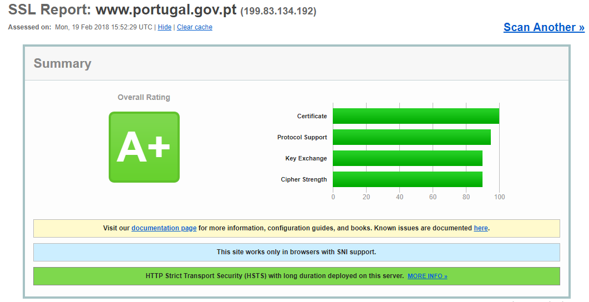
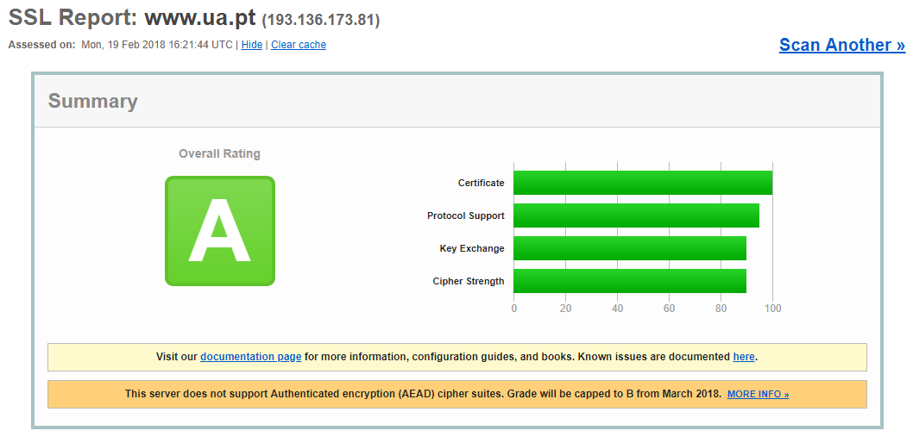
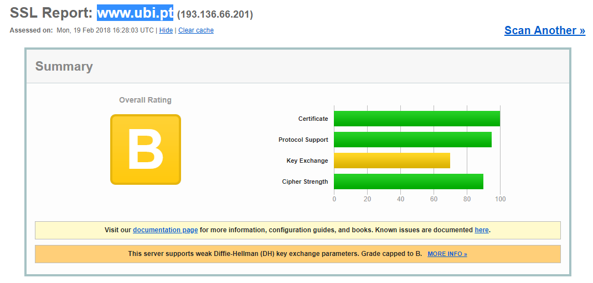
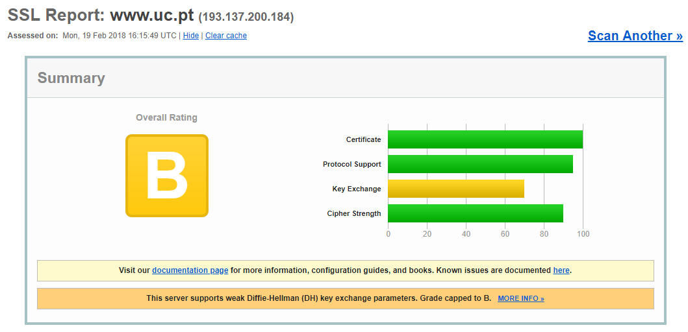
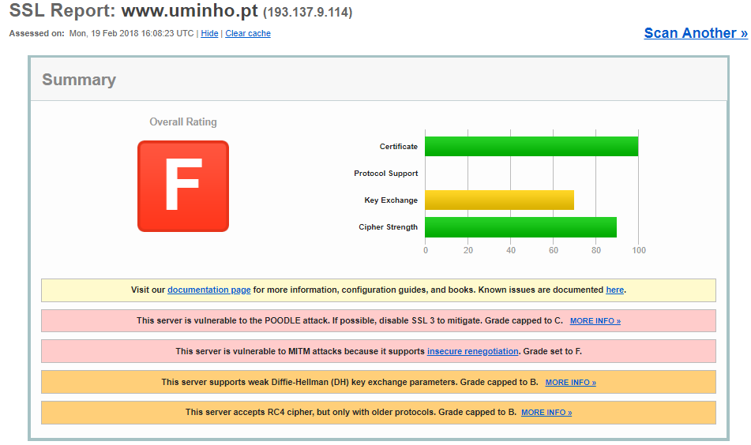

# 1. Assinaturas cegas (Blind signatures) baseadas no Elliptic Curve Discrete Logarithm Problem (ECDLP)

## Pergunta 1.1

 
 

# 2. Protocolo SSL/TLS

## Experiência 2.1

### Governo Português

- [Scan SSL](scans/governo.pdf)
- Resultado do teste online: https://www.ssllabs.com/ssltest/analyze.html?d=www.portugal.gov.pt

    

## Pergunta 2.1 - Universidades Portuguesas
Abaixo encontram-se os scans SSL de quatro Universidades Portuguesas escolhidas.

### A) Universidade de Aveiro

- [Scan SSL](scans/uni_aveiro.pdf)
- Resultado do teste online: https://www.ssllabs.com/ssltest/analyze.html?d=www.ua.pt

    

### B) Universidade Beira Interior

- [Scan SSL](scans/uni_beira_interior.pdf)
- Resultado do teste online: https://www.ssllabs.com/ssltest/analyze.html?d=www.ubi.pt

    

### C) Universidade de Coimbra

- [Scan SSL](scans/uni_coimbra.pdf)
- Resultado do teste online: https://www.ssllabs.com/ssltest/analyze.html?d=www.uc.pt

    

### D) Universidade do Minho

- [Scan SSL](scans/uni_minho.pdf)
- Resultado do teste online: https://www.ssllabs.com/ssltest/analyze.html?d=www.uminho.pt

    

- O site com pior rating é o site da Universidade do Minho (www.uminho.pt) com um rating F.

    São apresentados 4 comentários relativamente à sua segurança:

    - "This server is vulnerable to the POODLE attack. If possible, disable SSL 3 to mitigate. Grade capped to C."
    - "This server is vulnerable to MITM attacks because it supports insecure renegotiation. Grade set to F."
    - "This server supports weak Diffie-Hellman (DH) key exchange parameters. Grade capped to B."
    - "This server accepts RC4 cipher, but only with older protocols. Grade capped to B."

    É possível ver que o site está sujeito a dois tipos de ataques: ataques Man-in-the-middle e ataques POODLE (Padding Oracle On Downgraded Legacy Encryption que são um exploit Man-in-the-middle). Ambos são ataques perigosos uma vez que põe em causa dados existentes no site (incluindo dados de alunos e professores).

    Os parâmetros relativos ao acordo de chaves Diffie-Hellman também são fracos, dando possibilidade a que ataques Logjam ocorram, compromentendo a segurança do site.

    Também usa a cifra RC4 apenas suportando protocolos antigos o que leva a vulnarabilidades que já podem ter sido resolvidas com protocolos mais recentes.

    Todos estes fatores contribuem para o rating final.

- SNI (Server Name Indication) é uma extensão ao protocolo TLS onde o cliente indica o hostname a que se está a tentar conectar no início da fase de handshake.

    Em termos práticos, permite que um servidor distribua vários certificados através do mesmo endereço IP e através da mesma porta, permitindo que o mesmo distribua várias páginas HTTPS com certificados diferentes.

(**FONTE: https://en.wikipedia.org/wiki/Server_Name_Indication**)
 
 

## 3. Protocolo SSH

### Pergunta 3.1

- #### Universidade de Aveiro: 

    1. **Resultados do ssh-audit:** [lars.mec.ua.pt.txt](ssh-audit\lars.mec.ua.pt.txt)
    2. **Software e versão utilizada:** Apache/2.4.7 (Ubuntu)
    3. **Versões de software com mais vulnerabilidades:** Versão de 2017 (217 vulnerabilidades) - 2.4
    4. **Qual tem a vulnerabilidade mais grave?:** Existem várias versões com vulnerabilidades com pontuação 10.0. A mais recente foi descoberta a 2017-11-14, CVE-2017-12635 (https://www.cvedetails.com/cve/CVE-2017-12635/)
    5. **A vulnerabilidade indicada no ponto anterior é grave? Porquê?:** Sim, é. A vulnerabilidade permite que utilizadores não-admin acedam a comandos de shell arbitrários no servidor como utilizador do sistema da base de dados, de uma forma geral, oermite aos utilizadores que não administradores, usufruir de privilégios de administrador.

- #### Universidade do Minho: 

    1. **Resultados do ssh-audit:** [prova.di.uminho.pt.txt](ssh-audit\prova.di.uminho.pt.txt)
    2. **Software e versão utilizada:** Cherokee/1.2.101 (Debian GNU/Linux)
    3. **Versões de software com mais vulnerabilidades:** As versões de 2001 e 2004 possuem ambos 2 vulnerabilidades, sendo estas as que têm mais.
    4. **Qual tem a vulnerabilidade mais grave?:** A versão que tem a vulnerabilidade mais grave é a de 2005, com pontuação 10.0. Descoberta em 2005-01-10, CVE-2004-1097 (https://www.cvedetails.com/cve/CVE-2004-1097/)
    5. **A vulnerabilidade indicada no ponto anterior é grave? Porquê?:** Sim. Permite que os atacantes remotos causem uma negação de serviço (falha na aplicação) ou possivelmente executem código arbitrário através de especificadores de string de formato URL.
