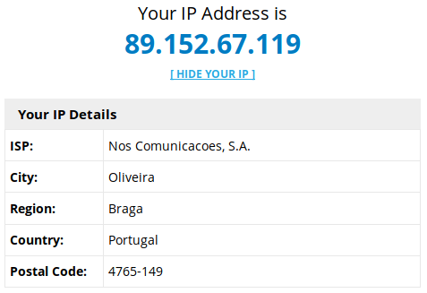
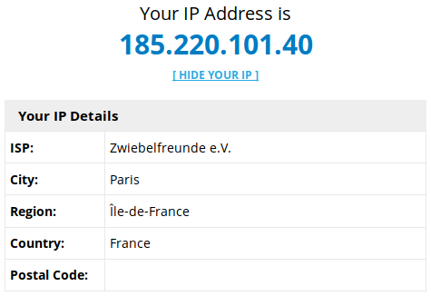
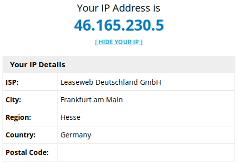
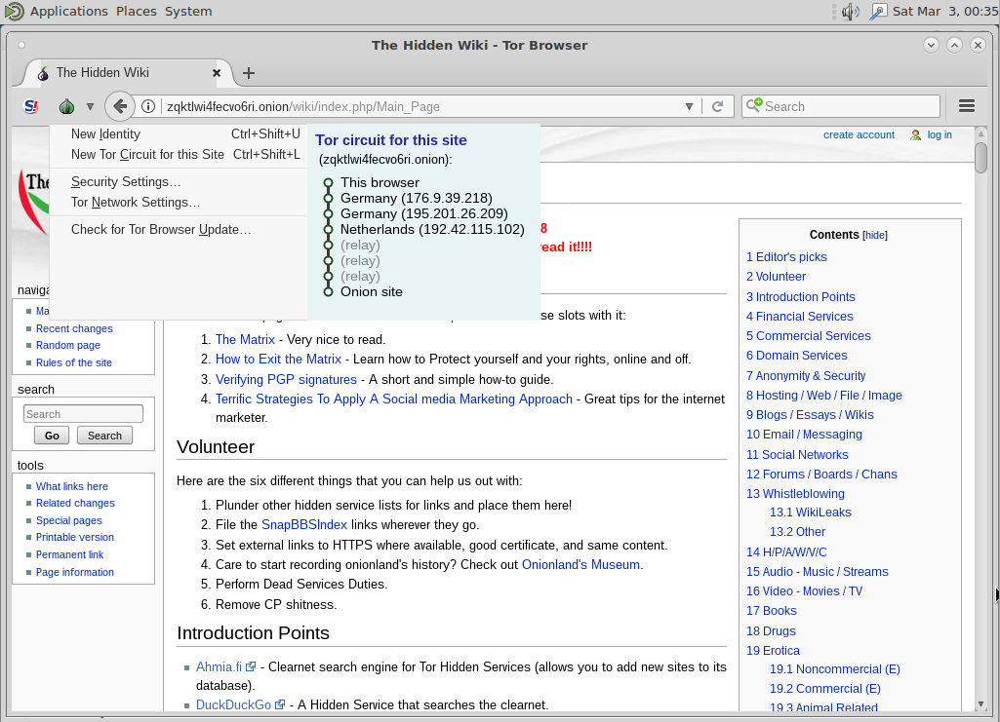
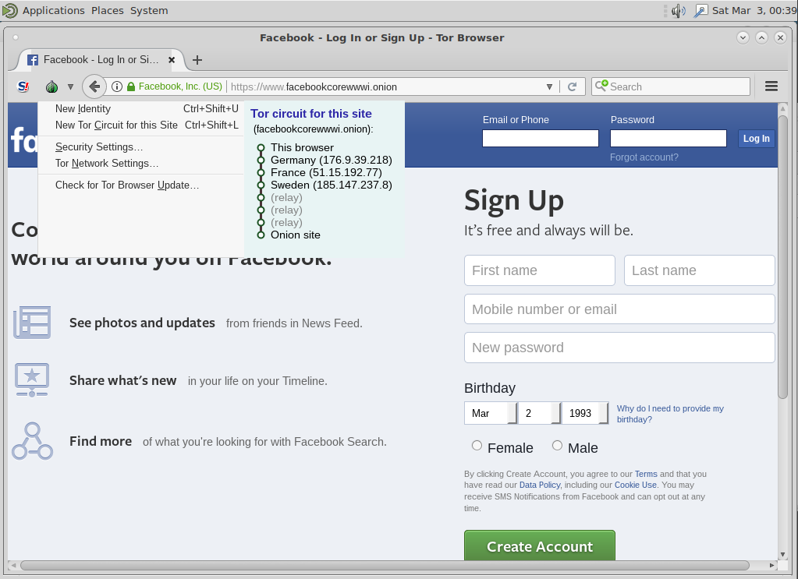

# 1. TOR (The Onion Router)

## Experiência 1.1

1. Abra o browser e vá a http://myiplocator.net/

   - Aponte o seu endereço IP e localização

        


2. Na linha de comando execute ```sudo anonsurf start```

3. Faça reload (shift-reload) da página web onde se encontrava

    - Aponte o seu endereço IP e localização (note que se não mudou, é porque existiu algum erro)

        


4. Na linha de comando execute ```sudo anonsurf change```

5. Faça reload (shift-reload) da página web onde se encontrava

    - Aponte o seu endereço IP e localização (note que se não mudou, é porque existiu algum erro)

        


6. Na linha de comando execute ```sudo anonsurf stop```

7. Faça reload (shift-reload) da página web onde se encontrava

    - Aponte o seu endereço IP e localização (note que se não é o inicial, é porque existiu algum erro)

        ")


<br/>

## Pergunta 1.1

Para aceder a alguns sites nos EUA tem que estar localizado nos EUA.

1. Efetuando o comando ```sudo anonsurf start``` consegue garantir que está localizado nos EUA?

    Não, não épossível garantí-lo.

2. Porquê? Utilize características do protocolo TOR para justificar.

    O protocolo associado ao TOR rege-se pelo anonimato ponto-a-ponto. Isto é, não é possível provar a localização de um terminal. As localizações são normalmente aleatórias, não sendo atribuída uma em específico. São sempre fictícias.
    
    (**FONTE: https://pt.wikipedia.org/wiki/Tor_(rede_de_anonimato)**)


## Pergunta 1.2

1. http://zqktlwi4fecvo6ri.onion/wiki/index.php/Main_Page

    

2. https://www.facebookcorewwwi.onion/

    

Os 6 saltos garantem o anonimato ponto-a-ponto. O "rendezvous points", permitem que os utilizadores se conectem aos serviços Onion, anteriormente conhecidos como serviços ocultos, sem que cada um conheça a identidade da rede do outro.
Os vários saltos, permitem que cada um tenha conecimento de metade do percurso e os *relay* garantem que o utilizador não tenha qualquer conhecimento desse mesmo circuito, mostrando uma vez mais a existência de anonimato.

**(FONTE: https://www.torproject.org/docs/onion-services.html.en, https://www.torproject.org/about/overview.html.en)**